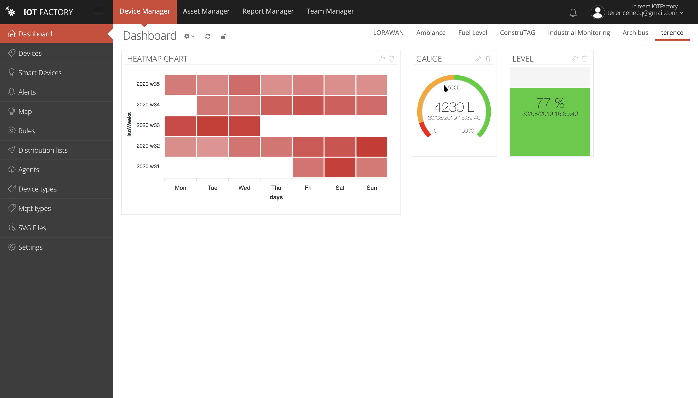
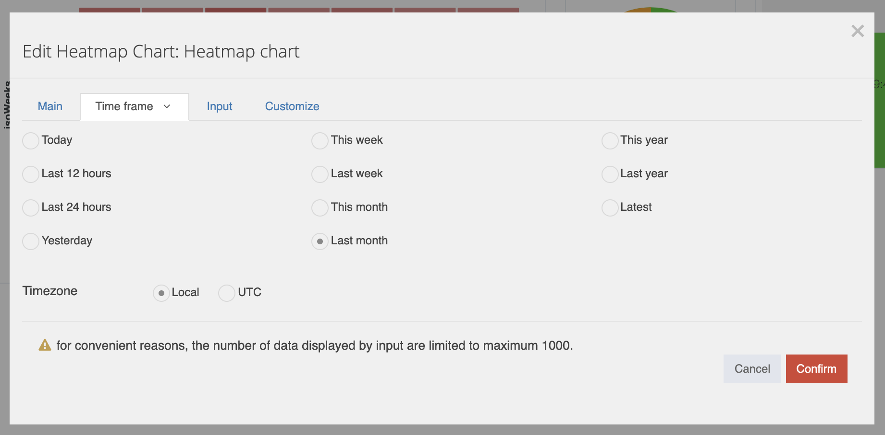
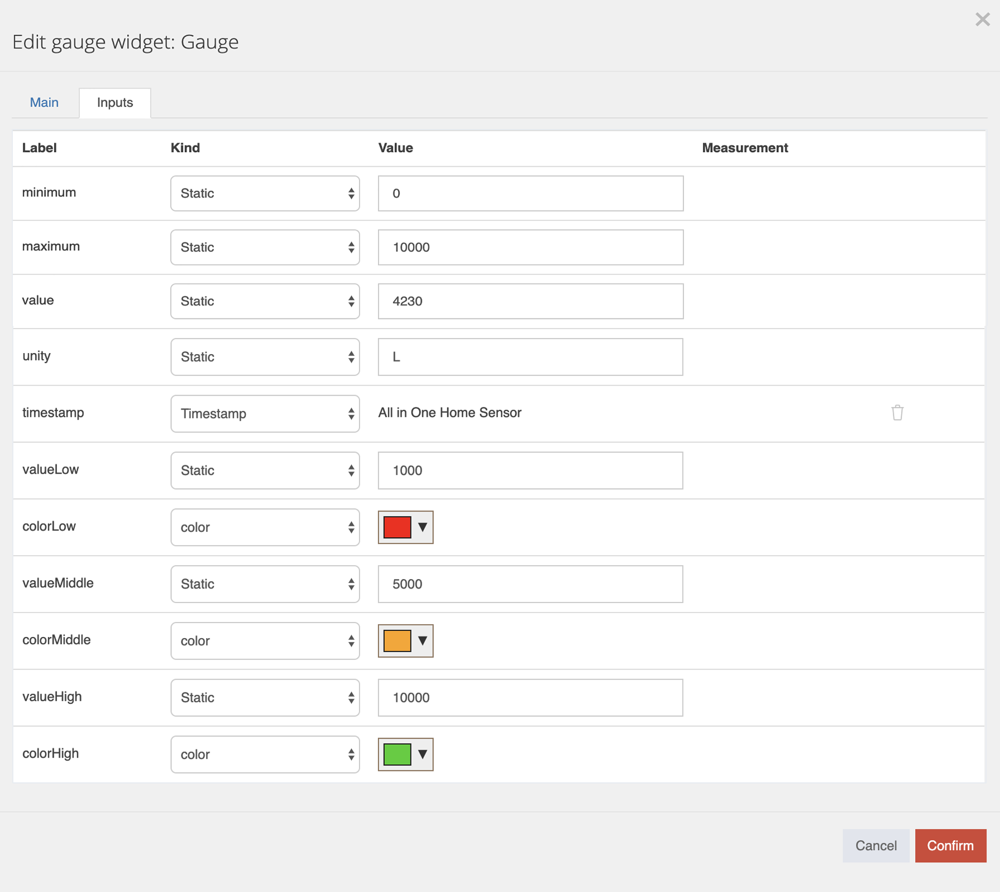
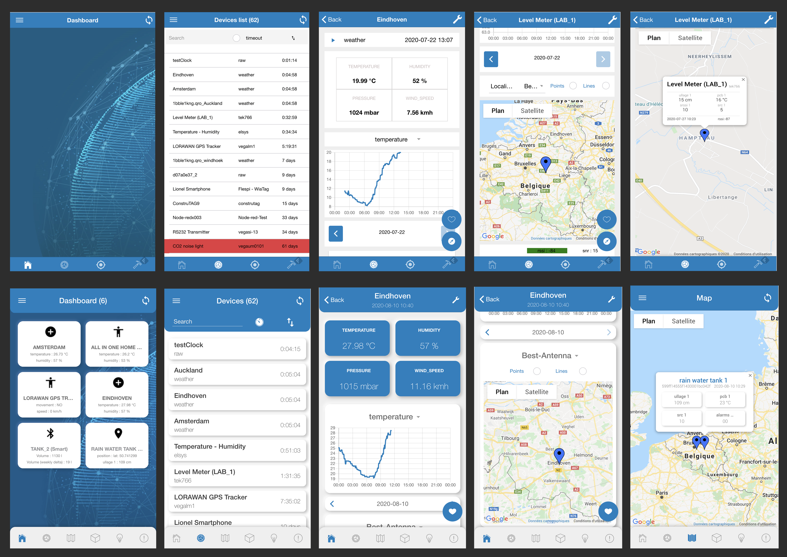

# IOT Factory internship

This repository is a showcase of what I did during my 2 1/2 moths internship at IOT Factory. As I can't upload here the code for the whole projects, it only contains the files that I wrote.

[Go to mobile app](#2.-mobile-app)

## **1. Widgets**

#### **Technologies :** 

- Angular JS
- Pug
- API's

#### **1.1 Heatmap Chart widget**

I used [**ApexCharts**](https://apexcharts.com/) to develop this widget (first on the image above).

The purpose of this widget is to show data (obvously) of a given period in a visual way.
In the edit panel the user can set a name for the widget, *change the timeframe* (image below), choose an input & customize graph's color.

Data can be retreived by API's, they are treated and displayed in a proper way.

#### **1.2 Gauge & level**

I used SVG's to develop this widget. (2nd & 3rd on the first image)

This is 2in1 as the user can choose either gauge or level in the same widget.

For these two, the purpose was to make it the more customizable as possible for the colors & the limits.

## **2. Mobile app**

Concerning the mobile app, I'm not able to put the code on my personal GitHub.

I mainly worked on the **design** in **adobe Xd** & then applied it to the **Ionic** & **Sass** files.

My last task was to **deploy** [IOT Factory App](https://apps.apple.com/be/app/iot-factory-mobile/id1525719085?l=fr) on the *Apple App Store*. After some little bugs & dependencies corrections, I did it ! (check the link)

